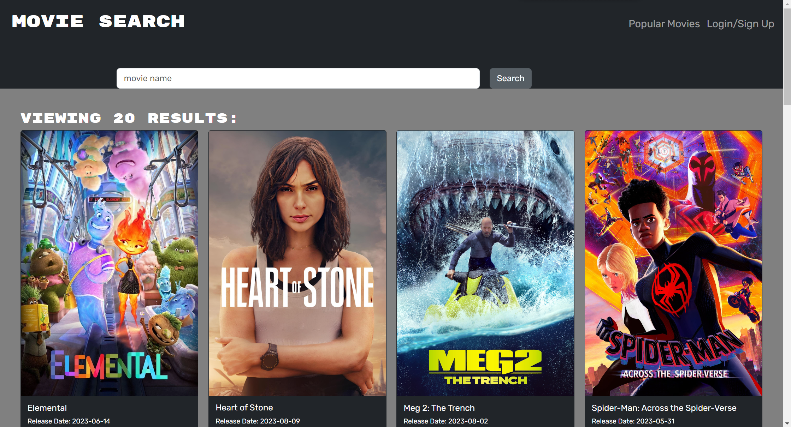
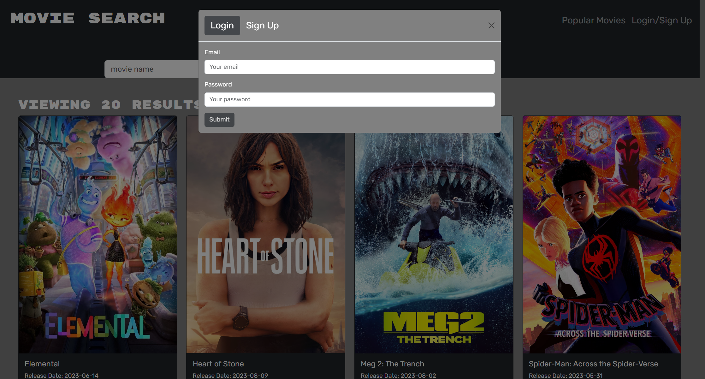
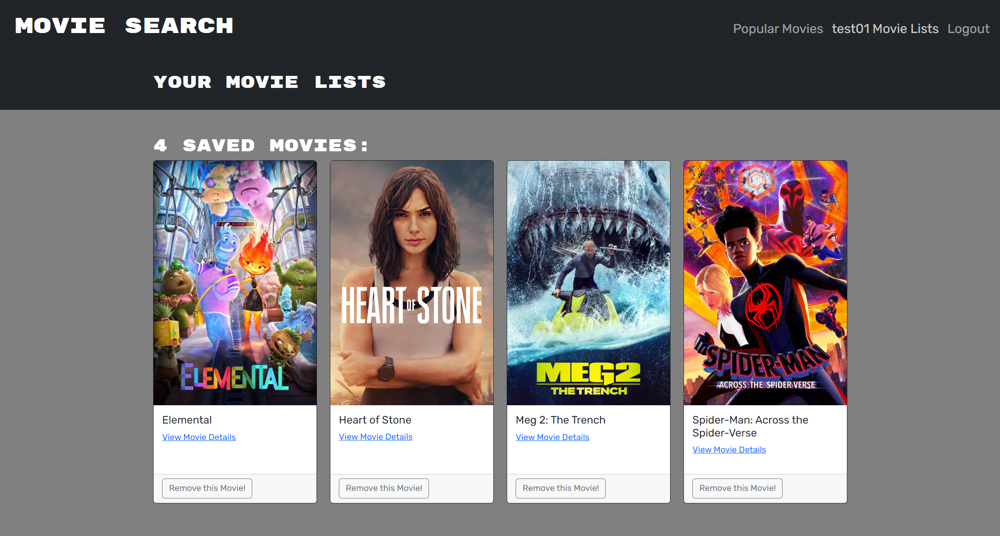
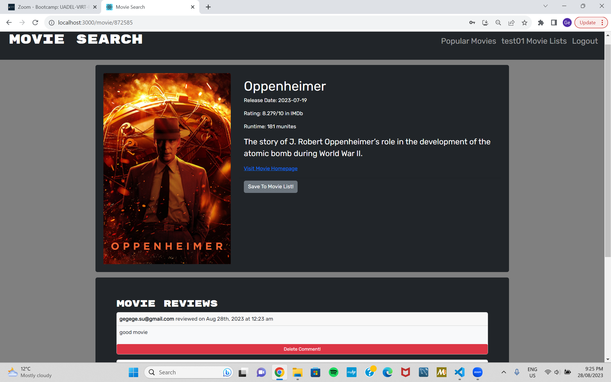
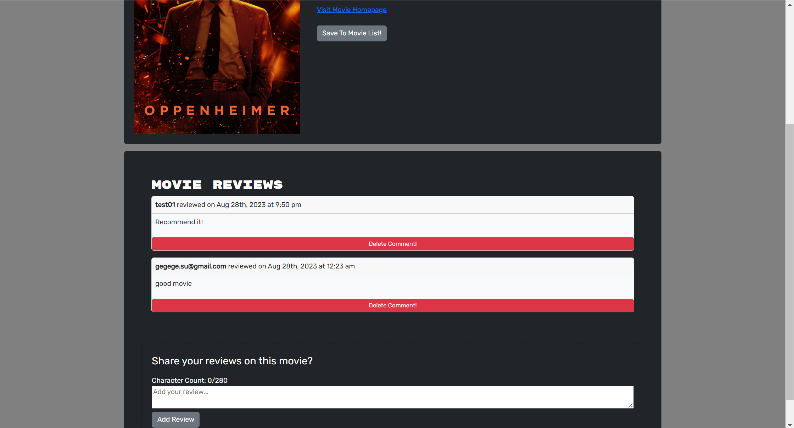

# Movies-Search

[](https://opensource.org/licenses/MIT)

















## Table of Contents

- [Description](#Description)
- [Installation](#Installation)
- [Local Usage](#Local-Usage)
- [Links](#Links)
- [License](#License)
- [Author](#Author)

##

## Description

This Full-Stack Movie Search application allows users to search movie information by using The Movie Database API. Users can search a single movie, view the information and create their own movie list by adding and deleting the movie; view the saved book and delete the saved book. User needs to sign up or login, all the saving, viewing and deleting books transactions are processed with high level authentication via tokens and JTW-decode

## Installation

1. To install application, clone the repository to your local by using the command:

   git clone https://github.com/gesu001/Movies-Search.git

2. Once cloned, open the project folder in your text editor and run the following command in terminal to install all dependencies by running the command under the root folder "main":

   npm i

## Local-Usage

To view the application in your local browser, cd into the root directory "Movies-Search" and run this command in terminal:

```
npm run develop
```

## Links

[Link to repository](https://github.com/gesu001/Movies-Search)

[Link to the Heroku deployed application](https://desolate-journey-66900-cc42474101ef.herokuapp.com/)

## Built With Technologies

- React
- Apollo Client
- GraphQL
- Json web token
- Jwt-decode
- MongoDB
- Mongoose
- React-bootstrap
- Bootstrap
- Express
- Node.js
- Bcrypt
- localStorage
- JSX / JavaScript
- HTML
- CSS

## Authors

Welcome to visit my Github and LinkedIn pages, contact me with any questions.

[Github](https://github.com/gesu001)

[LinkedIn](https://www.linkedin.com/in/ge-su-4b319388/)

[Email](gegege.su@gmail.com)

## License

This project is covered under the MIT License.
